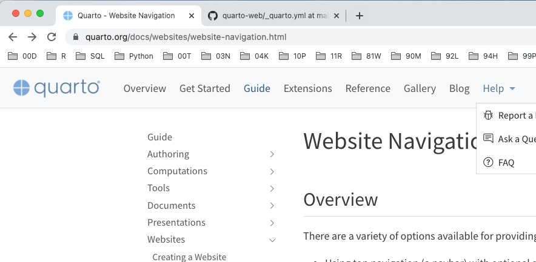

# メモ書き

## MacでRStudio 日本語入力のイライラを解決する方法

まずダミーのファイルを一つ作って、その後、作業したいファイルを編集すれば、ストレスなく日本語入力できるようになります。

https://walkintheforest.net/rstudio-editor-japanese/

## 参考文献

- Rによるやさしい統計学 (Kindle)
## docsフォルダにRenderしたいとき

_quarto.yamlに下記の通り設定する

[Render to docs](https://quarto.org/docs/publishing/github-pages.html#render-to-docs)

## Combining R and Python with {reticulate} and Quarto

https://www.r-bloggers.com/2023/01/combining-r-and-python-with-reticulate-and-quarto/

## A Quarto tip a day

投稿の仕方の参考になりそう。

https://mine-cetinkaya-rundel.github.io/quarto-tip-a-day/

## How to write mathematics

[Markdownに数式を挿入する方法](https://b1san-blog.com/post/vscode/vscode-md-math/)

[LaTeX/Mathematics](https://en.wikibooks.org/wiki/LaTeX/Mathematics)

[Mathematics in R Markdown](https://rpruim.github.io/s341/S19/from-class/MathinRmd.html)

## htmlとmarkdownの両方に出力する方法

```
library(rmarkdown)
rmarkdown::render("statistics_01.Rmd",output_format = "html_document")
rmarkdown::render("statistics_01.Rmd",output_format = "md_document")
```

## Google analytics設定

下記に記載(Private repository)

https://github.com/Nobukuni-Hyakutake/hon/blob/main/quarto/memo.md


## 右側の目次

_quarto.ymlに下記を加えると右側にページ内の目次がでる。

```
format:
  html:
    toc: true
```


## Wordファイルに出力する方法

```
quarto render index.qmd --to docx  
```

## 上部のナビゲージョンバーを入れ子にしたいとき

下記のHelpのように、クリックするとさらに選択肢が出てくるようにする



```
  navbar:
    background: light
    logo: quarto.png
    logo-alt: "Quarto logo."
    title: false
    collapse-below: lg
    left:
      - text: "Overview"
        href: index.qmd
      - text: "Get Started"
        href: docs/get-started/index.qmd
      - text: "Guide"
        href: docs/guide/index.qmd
      - text: Extensions
        href: docs/extensions/index.qmd
      - text: "Reference"
        href: docs/reference/index.qmd
      - text: "Gallery"
        href: docs/gallery/index.qmd
      - text: "Blog"
        href: docs/blog/index.qmd
      - text: "Help"
        menu:
          - text: "Report a Bug"
            icon: "bug"
            href: "https://github.com/quarto-dev/quarto-cli/issues"
          - text: "Ask a Question"
            icon: "chat-right-text"
            href: "https://github.com/quarto-dev/quarto-cli/discussions"
          - text: "FAQ"
            icon: "question-circle"
            href: docs/faq/index.qmd
```

## python list結合

```
# coding: utf-8
# 130秒でできた
import time
t1 = time.time() 

import pandas as pd
fname = '../../big_csv/14gb_csv_sample.csv'
def preprocess(x): #必要な部分だけを取り出す前処理。ここでデータを削減しないと処理速度が上がらない。
    x=x.loc[(x['0']<0.01),['1']]
    return x    
reader = pd.read_csv(fname,chunksize=100000)
df04=pd.concat((preprocess(r) for r in reader),ignore_index=True)
df04.to_csv('pandas_chunk_14gb_to_extract.csv')

t2 = time.time()
elapsed_time = round((t2-t1),1)
print(f"Elapsed time：{elapsed_time} s")
```