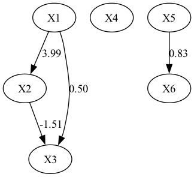

## Lingam 例1

```{python}
import lingam
from lingam.utils import make_dot
import numpy as np
import pandas as pd

# 再現性のためのシード設定
np.random.seed(42)
n_samples = 1000

# 1. ノイズ（非ガウス分布）の生成
e1 = np.random.uniform(-1, 1, n_samples)
e2 = np.random.uniform(-1, 1, n_samples)
e3 = np.random.uniform(-1, 1, n_samples)

# 2. 因果構造の定義 (X1 -> X2, X1 -> X3, X2 -> X3)
x1 = e1
x2 = 2.0 * x1 + e2
x3 = 0.5 * x1 - 1.5 * x2 + e3

df = pd.DataFrame({"X1": x1, "X2": x2, "X3": x3})

# LiNGAMの実行
model = lingam.DirectLiNGAM()
model.fit(df)

# df.columns を .tolist() でリスト化して渡します
dot = make_dot(model.adjacency_matrix_, labels=df.columns.tolist())

# 画像として保存（カレントディレクトリに causal_graph.png が生成されます）
dot.render("causal_graph1", format="png")
print("正常にグラフ画像が出力されました")
```


## Lingam 例2

```{python}
# 再現性のためのシード設定
np.random.seed(101)

# 1. ノイズ（非ガウス分布）の生成
e1 = np.random.uniform(-1, 1, n_samples)
e2 = np.random.uniform(-1, 1, n_samples)
e3 = np.random.uniform(-1, 1, n_samples)
e4 = np.random.uniform(-1, 1, n_samples)
e5 = np.random.uniform(-1, 1, n_samples)
e6 = np.random.uniform(-1, 1, n_samples)

# 2. 因果構造の定義 (X1 -> X2, X1 -> X3, X2 -> X3,X5 -> X6)
x1 = e1
x2 = 4.0 * x1 + e2
x3 = 0.5 * x1 - 1.5 * x2 + e3
x4=e4
x5=e5
x6= 0.8*x5+e6

df = pd.DataFrame({"X1": x1, "X2": x2, "X3": x3,"X4": x4,"X5": x5,"X6": x6})

# LiNGAMの実行
model = lingam.DirectLiNGAM()
model.fit(df)

# df.columns を .tolist() でリスト化して渡します
dot = make_dot(model.adjacency_matrix_, labels=df.columns.tolist())

# 画像として保存（カレントディレクトリに causal_graph.png が生成されます）
dot.render("causal_graph2", format="png")
print("正常にグラフ画像が出力されました")
```



## Python version

```{python}
import platform
"Python version "+platform.python_version()
```
