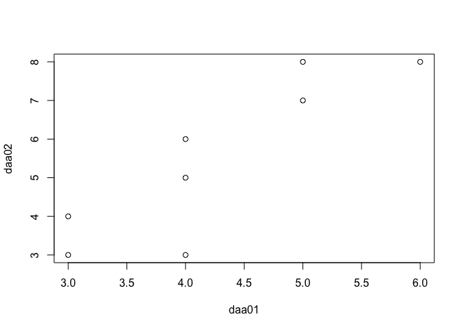

[Markdownに数式を挿入する方法](https://b1san-blog.com/post/vscode/vscode-md-math/)

[list of TeX functions](https://katex.org/docs/supported.html)

## 偏差平方和

$\displaystyle\sum^{n}\_{i=1}(x\_i-\overline{x})^2$

    daa01<-c(5,6,3,4,3,4,5,4)
    sum(
      (daa01-mean(daa01))^2
      )

    ## [1] 7.5

## 分散 (標本分散)

$s^2=\frac {\displaystyle\sum^{n}\_{i=1}(x\_i-\overline{x})^2} {n}$

    sum(
      (daa01-mean(daa01))^2
      )/
      length(daa01)

    ## [1] 0.9375

or

    var(daa01)*(length(daa01)-1)/length(daa01)

    ## [1] 0.9375

## 標準偏差(標本分散の平方根)

$s=\sqrt{\frac {\displaystyle\sum^{n}\_{i=1}(x\_i-\overline{x})^2} {n}}$

    sqrt(
      var(daa01)*(length(daa01)-1)/length(daa01)
      )

    ## [1] 0.9682458

or

    sd(daa01)*
      sqrt(
      (length(daa01)-1)/length(daa01)
    )

    ## [1] 0.9682458

## 変動係数

$C.V.=\frac {s} {\overline{x}}$

    sd(daa01)*
      sqrt(
      (length(daa01)-1)/length(daa01)
    )/
      mean(daa01)

    ## [1] 0.2278225

## 相関係数

$r=\frac {\displaystyle\sum^{n}\_{i=1}(x\_i-\overline{x}) (y\_i-\overline{y})} {\sqrt{ {\displaystyle\sum^{n}\_{i=1}(x\_i-\overline{x})^2}} \sqrt{ {\displaystyle\sum^{n}\_{i=1}(y\_i-\overline{y})^2}}}$

    daa02<-c(7,8,3,5,4,3,8,6)
    cor(daa01,daa02,method="pearson")

    ## [1] 0.8666667

    plot(daa01,daa02)

